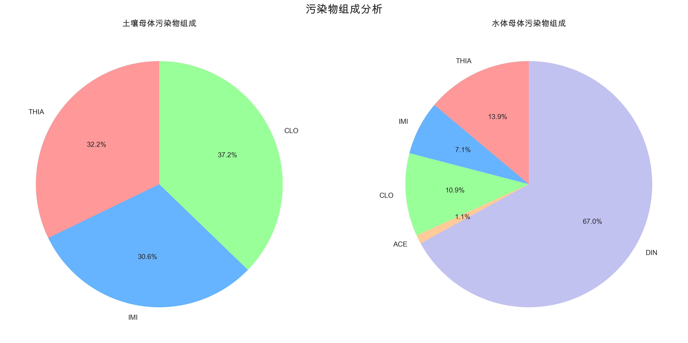
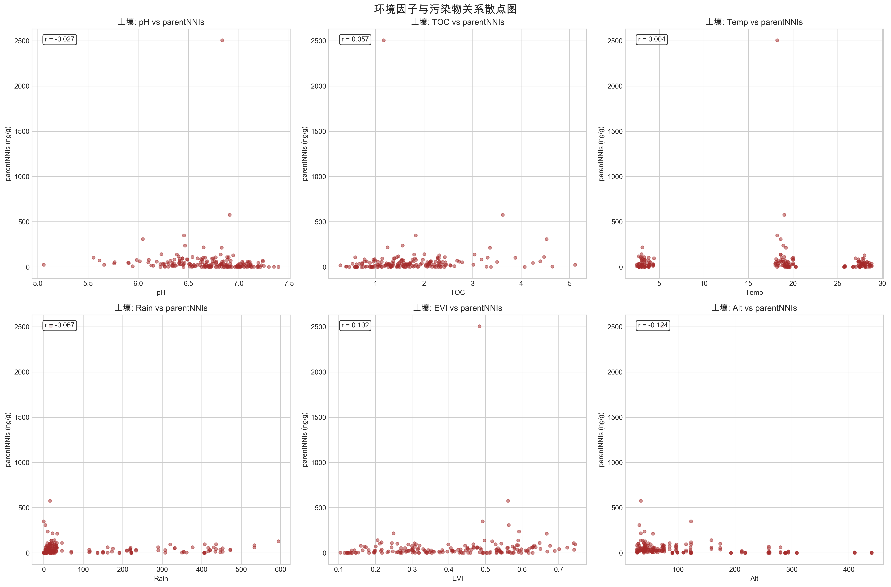
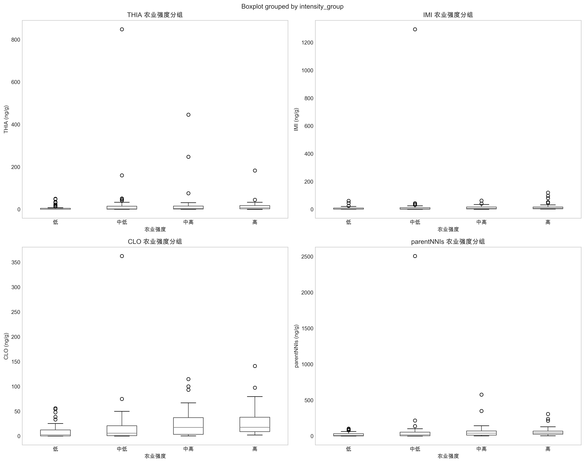
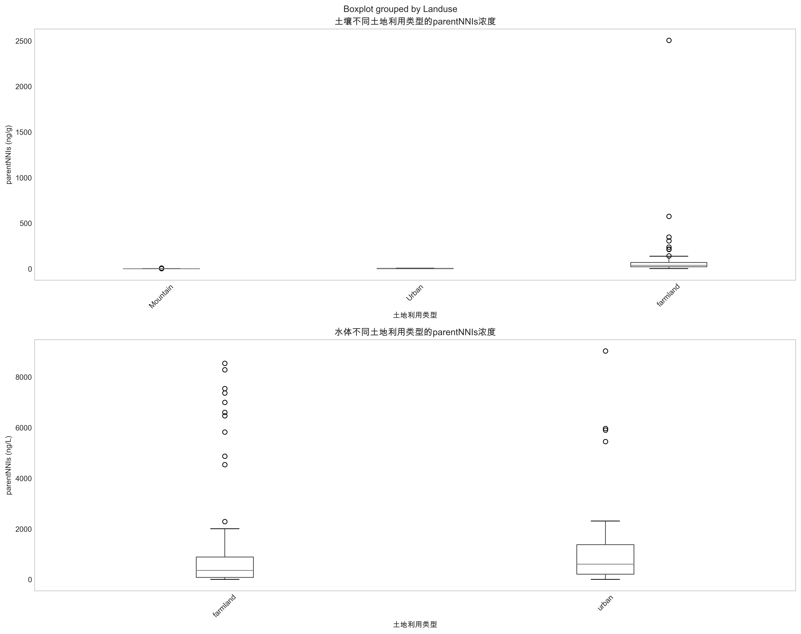
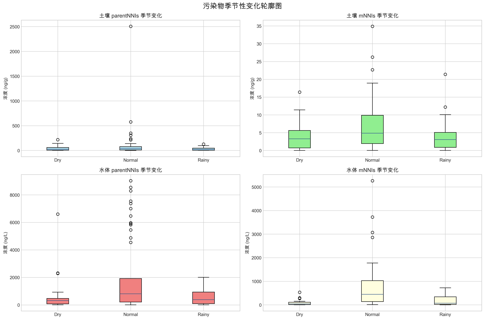
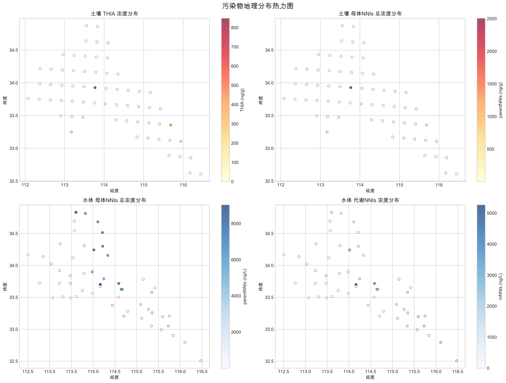

# 土壤和水体污染物数据集探索性分析报告

## 1. 数据集概览

### 1.1 数据基本信息
- **土壤数据集**：186个样本，51个特征
- **水体数据集**：159个样本，58个特征
- **数据完整性**：两个数据集均无缺失值，数据质量等级为优秀
- **地理范围**：
  - 土壤：经度112.078°~116.445°，纬度32.604°~34.872°
  - 水体：经度112.508°~116.474°，纬度32.506°~34.832°

### 1.2 季节分布
两个数据集在三个季节均匀分布：
- 旱季（Dry）：62个样本
- 正常季节（Normal）：62个样本
- 雨季（Rainy）：62个样本

## 2. 污染物浓度分析

### 2.1 土壤污染物浓度统计

**母体污染物（单位：ng/g）**：
| 污染物 | 检出率 | 平均浓度 | 中位数 | 标准差 | 最大值 |
|--------|--------|----------|--------|--------|--------|
| THIA | 84.4% | 18.39 | 3.43 | 74.09 | 847.76 |
| IMI | 94.6% | 17.47 | 4.32 | 95.52 | 1294.20 |
| CLO | 91.4% | 21.29 | 10.04 | 34.88 | 362.45 |
| parentNNIs | 100.0% | 57.23 | 27.53 | 191.63 | 2504.86 |

**代谢物污染物（单位：ng/g）**：
| 污染物 | 检出率 | 平均浓度 | 中位数 | 标准差 | 最大值 |
|--------|--------|----------|--------|--------|--------|
| IMI-UREA | 42.5% | 0.40 | 0.00 | 1.61 | 17.28 |
| DN-IMI | 84.4% | 2.37 | 1.84 | 2.33 | 11.38 |
| CLO-UREA | 51.1% | 0.36 | 0.16 | 0.67 | 5.42 |
| mNNIs | 89.2% | 4.80 | 3.65 | 5.15 | 34.88 |

### 2.2 水体污染物浓度统计

**母体污染物（单位：ng/L）**：
| 污染物 | 检出率 | 平均浓度 | 中位数 | 标准差 | 最大值 |
|--------|--------|----------|--------|--------|--------|
| THIA | 84.9% | 146.49 | 40.40 | 368.57 | 4246.80 |
| IMI | 91.2% | 74.70 | 44.80 | 133.44 | 1441.00 |
| CLO | 75.5% | 114.92 | 35.00 | 201.73 | 999.40 |
| ACE | 81.8% | 12.07 | 8.80 | 13.34 | 69.60 |
| DIN | 97.5% | 707.92 | 75.80 | 1735.81 | 8758.00 |
| parentNNIs | 100.0% | 1070.81 | 380.20 | 1869.07 | 9024.60 |

**代谢物污染物（单位：ng/L）**：
| 污染物 | 检出率 | 平均浓度 | 中位数 | 标准差 | 最大值 |
|--------|--------|----------|--------|--------|--------|
| IMI-UREA | 59.7% | 14.98 | 10.60 | 17.82 | 82.00 |
| DN-IMI | 58.5% | 197.82 | 32.20 | 479.06 | 3940.60 |
| DM-ACE | 23.3% | 0.43 | 0.00 | 1.01 | 5.80 |
| CLO-UREA | 68.6% | 77.11 | 20.00 | 147.13 | 1088.00 |
| mNNIs | 94.3% | 347.06 | 111.80 | 673.33 | 5262.20 |

### 2.3 污染物组成分析

**土壤母体污染物组成**：
- CLO: 37.25%
- THIA: 32.19%
- IMI: 30.56%

**水体母体污染物组成**：
- DIN: 67.03%
- THIA: 13.87%
- CLO: 10.88%
- IMI: 7.07%
- ACE: 1.14%

## 3. 环境因子关联分析

### 3.1 土壤环境因子相关性

**强相关性（|r| > 0.3）**：
- mNNIs与NDVI：r = 0.316（强正相关）
- mNNIs与海拔：r = -0.441（强负相关）
- mNNIs与化肥使用：r = 0.306（强正相关）

### 3.2 水体环境因子相关性

**强相关性（|r| > 0.3）**：
- CLO与pH：r = -0.638（强负相关）
- CLO与溶解氧：r = -0.590（强负相关）
- CLO与水温：r = 0.355（强正相关）
- CLO与降水量：r = 0.382（强正相关）
- THIA与农药使用：r = 0.311（强正相关）

## 4. 农业活动影响分析

### 4.1 化肥农药使用量影响

**土壤高使用组 vs 低使用组浓度比值**：
| 污染物 | 化肥(FER)比值 | 农药(PES)比值 |
|--------|-------------|-------------|
| THIA | 3.02 | 2.61 |
| IMI | 3.73 | 3.29 |
| CLO | 2.32 | 2.00 |
| parentNNIs | 2.89 | 2.51 |

**水体高使用组 vs 低使用组浓度比值**：
| 污染物 | 化肥(FER)比值 | 农药(PES)比值 |
|--------|-------------|-------------|
| THIA | 1.81 | 1.78 |
| IMI | 1.41 | 1.49 |
| CLO | 1.66 | 1.42 |

### 4.2 农业强度分区分析

**土壤不同农业强度区污染物平均浓度（parentNNIs，ng/g）**：
- 低强度区：22.59
- 中低强度区：89.31
- 中高强度区：61.34
- 高强度区：60.31

**水体不同农业强度区污染物平均浓度（parentNNIs，ng/L）**：
- 低强度区：1285.65
- 中低强度区：788.11
- 中高强度区：831.17
- 高强度区：1405.98

## 5. 经济因素影响分析

### 5.1 城镇化水平影响

**土壤不同城镇化水平污染物浓度（parentNNIs，ng/g）**：
- 低城镇化：93.72
- 中低城镇化：63.49
- 中高城镇化：43.06
- 高城镇化：23.87

**水体不同城镇化水平污染物浓度（parentNNIs，ng/L）**：
- 低城镇化：965.89
- 中低城镇化：1049.56
- 中高城镇化：894.89
- 高城镇化：1380.95

### 5.2 经济发展水平影响

**水体高低GDP组对比**：
- THIA：高GDP组62.88 vs 低GDP组221.15
- IMI：高GDP组53.83 vs 低GDP组93.34
- CLO：高GDP组52.54 vs 低GDP组170.61

## 6. 土地利用影响分析

### 6.1 土壤土地利用类型统计
农田（farmland）样本141个，山地（Mountain）样本27个，城市（Urban）样本18个。

### 6.2 显著性差异检验结果
农田与其他土地利用类型在污染物浓度上存在显著差异（P < 0.05）：
- parentNNIs：farmland vs Mountain (效应量: 0.992)
- parentNNIs：farmland vs Urban (效应量: 0.979)
- IMI：farmland vs Mountain (效应量: 0.925)

## 7. 季节性变化分析

### 7.1 土壤季节性变化
**parentNNIs季节平均浓度（ng/g）**：
- 旱季：38.26
- 正常季节：103.74
- 雨季：29.69

### 7.2 水体季节性变化
**parentNNIs季节平均浓度（ng/L）**：
- 旱季：376.11
- 正常季节：411.33
- 雨季：482.99

## 8. 空间分布特征

### 8.1 空间自相关分析
- **土壤**：Moran's I = 0.0003，空间聚集性不显著
- **水体**：Moran's I = 0.0991，空间聚集性不显著

### 8.2 地理分布
采样点覆盖了经度112°~116°，纬度32.5°~34.8°的区域范围。

## 9. 数据质量评估

### 9.1 数据质量评分
- **土壤数据**：总体质量评分92.0/100（优秀）
- **水体数据**：总体质量评分94.4/100（优秀）

### 9.2 异常值分析
**土壤数据高异常值率变量（>5%）**：
- THIA：8.28%
- IMI：7.39%
- mNNIs：5.42%

**水体数据高异常值率变量（>5%）**：
- CLO：16.67%
- DIN：18.06%
- parentNNIs：8.81%
- mNNIs：7.33%

### 9.3 数据一致性
- 土壤代谢物总量一致性问题：71.17%的样本mNNIs与单项代谢物加总差异>20%
- 其他一致性指标良好

## 10. 土壤-水体对比分析

### 10.1 检出率对比
- THIA：土壤84.4% vs 水体84.9%（差异-0.5%）
- IMI：土壤94.6% vs 水体91.2%（差异3.4%）
- CLO：土壤91.4% vs 水体75.5%（差异15.9%）

### 10.2 浓度水平对比
所有共同污染物在土壤和水体间均存在显著差异（P < 0.05）：
- THIA：土壤21.79 ng/g vs 水体172.53 ng/L
- IMI：土壤18.46 ng/g vs 水体81.92 ng/L
- CLO：土壤23.29 ng/g vs 水体152.27 ng/L

## 11. 建模建议

### 11.1 目标变量选择
基于分析结果，建议选择以下目标变量进行预测：
- **主要目标**：水体parentNNIs浓度（检出率100%，涵盖所有母体污染物）
- **次要目标**：各单项母体污染物（THIA、IMI、CLO）

### 11.2 特征变量选择
**土壤特征变量（51个）**：
- 污染物浓度：THIA, IMI, CLO, parentNNIs, mNNIs及其代谢物
- 环境因子：pH, TN, TOC, Temp, Rain, EVI, NDVI, Alt等
- 农业变量：化肥、农药使用量、作物产量等
- 经济变量：城镇化率、GDP、城乡收入差距等
- 用水变量：各类用水量数据

**水体特征变量（排除污染物浓度后）**：
- 环境因子：pH, DO, COND, DOC, T_W, T_M, PREC, Alt
- 农业变量：化肥农药使用量、作物产量
- 经济变量：城镇化水平、GDP、人口等
- 用水变量：各类用水量数据

### 11.3 关键建模考虑因素
1. **农业活动强度**：化肥农药使用量与污染物浓度呈正相关
2. **城镇化水平**：城镇化程度与土壤污染物浓度呈负相关
3. **季节性因素**：正常季节污染物浓度相对较高
4. **土地利用类型**：农田区域污染物浓度显著高于其他类型
5. **环境因子**：pH、溶解氧、水温等与特定污染物存在强相关性

### 11.4 数据预处理建议
1. 处理高异常值率变量（CLO、DIN等）
2. 标准化/归一化处理
3. 考虑特征工程（如农业强度指数、代谢物/母体比值等）
4. 空间位置特征可能提供额外信息

---

*本报告基于数据的统计分析结果，为后续建模提供数据驱动的指导建议。*