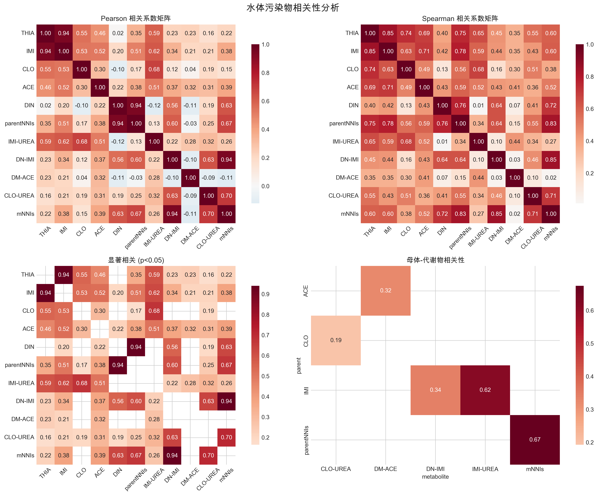
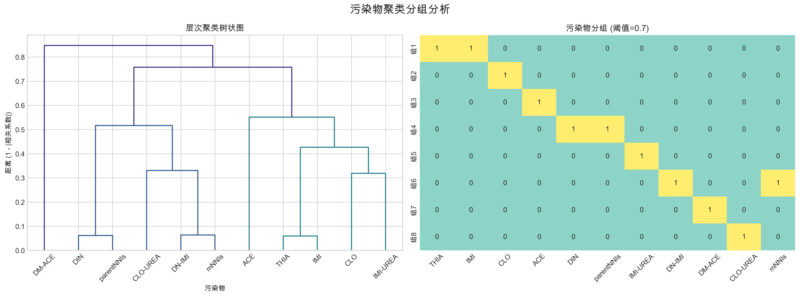
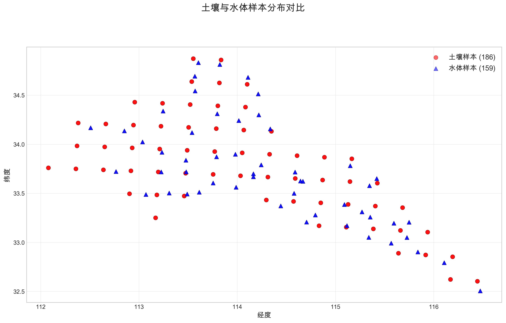
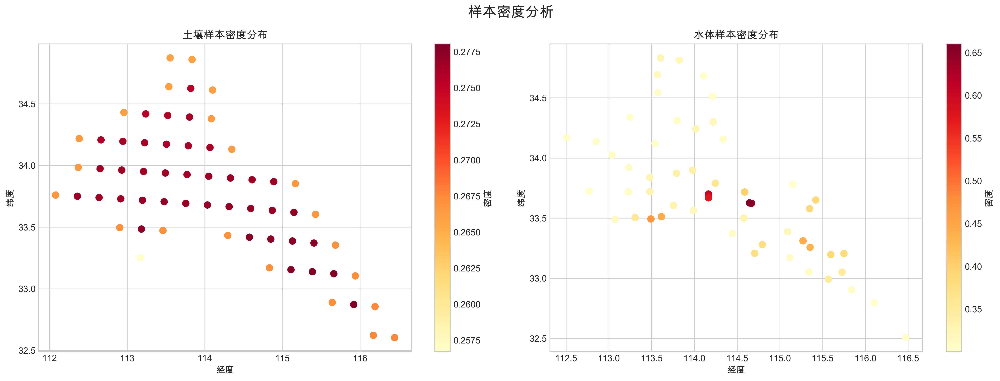
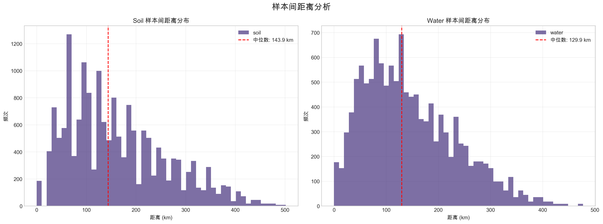

# 第一阶段任务综合报告：污染物相关性分析与时空分布特征分析

本报告总结了NNI污染物浓度预测研究第一阶段的核心成果，包括水体污染物相关性分析和时空分布特征分析。基于深入的数据分析，我们对建模策略进行了重要调整，特别针对污染物相关性较弱的特点提出了更合理的建模方案。

## 主要成果总结

### 1. 污染物相关性分析

#### 1.1 弱相关性主导

通过对55个污染物对的相关性分析，发现了重要模式：

| 相关系数范围 | 污染物对数量 | 占比 | 典型例子 |
|--------------|--------------|------|----------|
| \|r\| > 0.9 | 3对 | 5.5% | THIA-IMI, DIN-parentNNIs, DN-IMI-mNNIs |
| 0.7 < \|r\| ≤ 0.9 | 0对 | 0% | - |
| 0.5 < \|r\| ≤ 0.7 | 5对 | 9.1% | IMI-IMI-UREA(0.62), parentNNIs-mNNIs(0.67) |
| \|r\| ≤ 0.5 | 47对 | 85.4% | 大部分污染物对 |

#### 1.2 建模策略

**方案**：11个单输出模型 + 8个混合模型（对比验证）

**关键洞察**：85.4%的污染物对呈现弱相关性，可能需要避免将弱相关污染物强制组合建模。

#### 1.3 强相关性污染物对

仅3个污染物对具有强相关性(|r| > 0.7)：
- **THIA ↔ IMI**: r = 0.94（可能存在共同使用来源）
- **DIN ↔ parentNNIs**: r = 0.94（DIN是parentNNIs的主要组成部分）
- **DN-IMI ↔ mNNIs**: r = 0.94（DN-IMI是mNNIs的主要成分）

### 2. 时空分布特征分析

#### 2.1 空间分布特征

**关键发现**：
- **高度重叠**: 土壤和水体采样点地理分布高度一致
- **完全平衡**: 两个数据集在旱季、正常季节、雨季的样本完全相等
- **密度适中**: 平均每平方度约18个样本，为时空配对提供良好基础

#### 2.2 样本密度与距离分析

**统计数据**：
- **土壤样本**: 186个，平均距离162.8 km
- **水体样本**: 159个，平均距离145.3 km
- **密度相似**: 土壤密度18.78/平方度，水体密度17.24/平方度

#### 2.2 空间分布发现

**核心发现**：
- **高度重叠**: 土壤和水体采样点地理分布高度一致
- **密度适中**: 平均每平方度约18个样本
- **分布相对均匀**: 采样点覆盖整个研究区域，无明显空白区域

### 2.3 为网格划分提供的空间依据

基于密度分析为网格划分提供了参考参数：
- **网格大小参考**: 0.2° (22.2 km)
- **土壤网格参考**: 约264个网格单元
- **水体网格参考**: 约240个网格单元

## 策略调整

### 1. 建模策略调整

#### 1.1 问题识别
原始的混合建模策略基于以下假设：
- 大部分污染物存在显著相关性
- 多输出模型能够有效利用这种相关性

#### 1.2 现实情况
- **85.4%的污染物对相关性较弱** (|r| ≤ 0.5)
- 仅3个污染物对具有强相关性 (|r| > 0.7)
- 大部分污染物表现出独立的行为模式

#### 1.3 策略调整

**主要方案：11个单输出模型**
- **核心优势**：避免弱相关性污染物的相互干扰
- **灵活性**：每个污染物可独立优化特征和算法
- **可解释性**：更容易理解每个污染物的预测机制
- **避免偏差**：防止相关性阈值选择的主观性

**对比验证方案：8个混合模型**
- 作为对比基准
- 验证多输出模型的潜在优势

### 2. 验证策略重新设计

#### 2.1 对比验证框架
1. **实现11个单输出模型**作为基线方案
2. **实现混合8模型方案**作为对比方案
3. **在相同验证集上全面比较**：
   - 预测精度（RMSE、MAE、R²）
   - 计算效率（训练时间、预测时间）
   - 模型稳定性（交叉验证方差）
   - 可解释性（特征重要性、预测机制）

#### 2.2 评估指标优先级
1. **预测精度**：首要考虑因素
2. **计算效率**：实用性考量
3. **模型稳定性**：鲁棒性要求
4. **可解释性**：科学理解需求

### 3. 为网格划分提供的空间基础

#### 3.1 空间分布特征
- **地理一致性**: 土壤和水体采样点分布高度重叠
- **样本密度**: 适中密度为后续配对算法提供良好基础
- **距离分布**: 样本间距离分布有利于空间配对

#### 3.2 参考参数范围
基于分析结果，为Stage2网格设计提供参考：
- **网格大小参考**: 0.2° (22.2 km)
- **土壤网格参考**: 约264个网格单元
- **水体网格参考**: 约240个网格单元

## 新增文件和脚本

### 分析脚本
- `scripts/correlation_analysis.py` - 污染物相关性分析
- `scripts/spatiotemporal_analysis.py` - 时空分布分析

### 分析结果
- `outputs/stage1_correlation_analysis/` - 相关性分析完整结果
- `outputs/stage1_spatiotemporal_analysis/` - 时空分析完整结果

### 技术报告（已全部重新撰写）
- `docs/stage1_correlation_analysis_report.md` - 相关性分析报告
- `docs/stage1_spatiotemporal_analysis_report.md` - 时空分析报告
- `docs/stage1_summary_report.md` - 第一阶段综合报告
